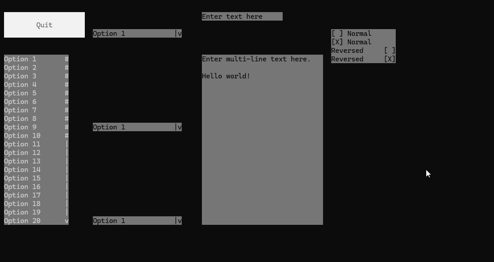

# Terminal Rendering EnginE (TREE)
 A rendering engine for a terminal.

 

## Features
- Support for Windows.
- Basic drawing and other graphics operations.
- Basic application and navigation support.
- Several default controls, such as:
  - Label
  - Button
  - List
  - Dropdown
  - Text Input
  - Checkbox

## Building and Linking

To use TREE in your project, you have two options. 1) add the header and source file directly to your project, or 2) build TREE, and link it to your program.

TODO: Tutorial

## Examples/Guides

Check out the [Test](Test/) directory for the demo project.

Check out the [Tutorial](https://github.com/mtalyat/TerminalRenderingEnginE/wiki/Tutorial) Wiki page for a usage guide.